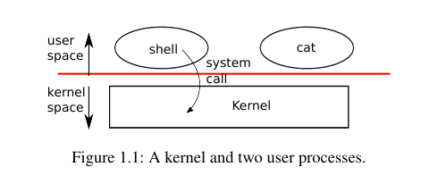
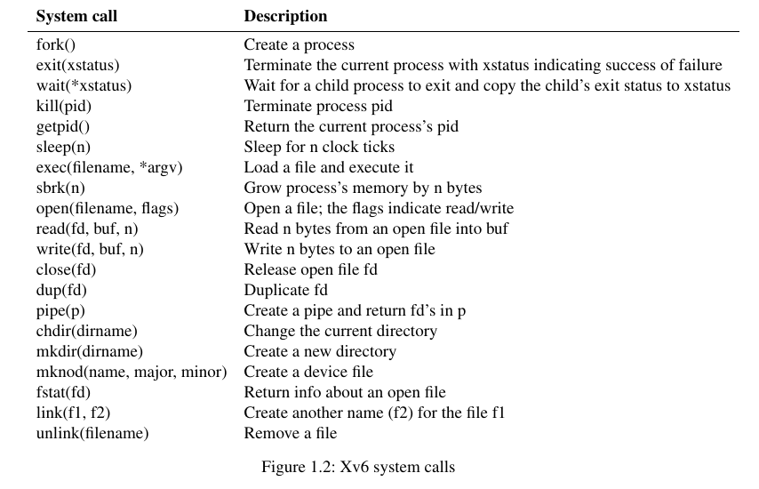

# xv6 notes🗒️

## OS interface

As shown in Figure [1.1](./img/kernel_processes.png), xv6 takes the traditional form of a *kernel*, a special program that provides services to running programs. Each running program, called a *process*, has memory containing instructions, data, and a stack. The instructions implement the program's computation. The data are the variables on which the computation acts. The stack organizes the program's procedure calls.



When a process needs to invoke a kernel service, it invokes a procedure call in the operating system interface. Such a procedure is called a *system call*. The system call enters the kernel; the kernel performs the service and returns. Thus a process alternates between executing in *user space* and *kernel space*.

The kernel uses the CPU's hardware protection mechanisms to ensure that each process executing in user space can access only its own memory. The kernel executes with the hardware privileges required to implement these protections; user programs execute without those privileges. When a user program invokes a system call, the hardware raises the privilege level and starts executing a pre-arranged function in the kernel.

The collection of system calls that a kernel provides is the interface that user programs see. The xv6 kernel provides a subset of the services and system calls that Unix kernel traditionally offer. Figure 1.2 lists all of xv6's system call.



Xv6 provides services: processes, memory, file descriptors, pipes, and a file system.

The **shell** is an ordinary program that reads commands from the user and executes them. The fact that the shell is a user program and not part of the kernel, illustrates the power of the system call interface: there is nothing special about the shell. It also means that the shell is easy to replace; as a result, modern Unix system have a variety of shells to choose from, each with its own user interface and scripting features. The xv6 shell is a simple implementation of the essence of the Unix Bourne shell. Its implementation can be found at [(user/sh.c:1)](https://github.com/mit-pdos/xv6-riscv/blob/riscv/user/sh.c).

### 1.1 Processes and memory

An xv6 process consists of user-space memory (instructions, data, and stack) and per-process state private to the kernel.
Xv6 can *time-share* processes: it transparently switches the available CPUs among the set of processes waiting to execute.
When a process is not executing, xv6 saves its CPU registers, restoring them when it next runs the process.
The kernel associates a process identifier, or *pid*, with each process.

A process may create a new process using the *fork* system call.
*Fork* creates a new process, called the *child process*, with exactly the same memory contents as the calling process, called the *parent process*. *Fork* returns in both the parent and the child. In the parent, *fork* returns the child's pid; in the child, it returns zero. For example, consider the following program fragment written in the C programming lang:

```C
int pid = fork();
if (pid > 0) {
    printf("parent: child=%d\en", pid);
    pid = wait(0);
    printf("child %d is done\en", pid);
} else if (pid == 0) {
    printf("child: exeting\en");
    exit(0);
} else {
    printf("fork error\en");
}
```

The *exit* system call causes the calling process to stop executing and to release resources such as memory and open files. Exit takes an integer status argument, conventionally 0 to indicate success and 1 to indicate failure. The *wait* system call returns the pid of an exited child of the current process and copies the exit status of the child to the address passed to wait; if none of the caller's children has exited, *wait* waits for one to do so. If the parent doesn't care about the exit status of a child, it can pass a 0 address to *wait*.